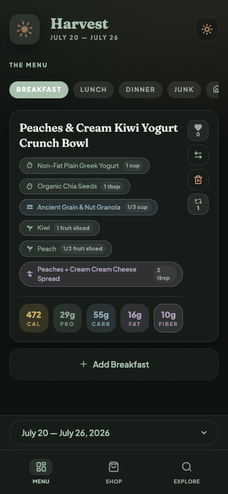

# Harvest

**A Trader Joe's–first meal planner that solves the question "What's for dinner?"**

My wife and I shop at Trader Joe's every week. I used to do the shopping and I'd reach for my favorites like steak, spaghetti bolognese, burgers, nachos, with an occasional healthier option like salmon thrown in. On top of that, we go out to eat fairly often, so we weren't eating healthy enough. We also got bored of everything we made — pizzas, curries, fried rice — we'd cycle through phases of eating something, getting sick of it, and going out a lot instead. I wanted to meet my wife's need for an ever-changing variety of healthy, home-cooked meals from ingredients at Trader Joe's.

With that in mind, I figured I'd use Claude or similar to meal plan for us, but I quickly realized I wanted a scaffold around it. I thought about just building skills, but realized Cursor could build the frontend in like an hour. Once I had it built, customizing it for our exact preferences and our Trader Joe's layout was easy. After a couple rounds of shopping to work out the kinks, my wife now does the shopping and I make dinner. I can honestly say this app has done more to reduce stress in my marriage than anything else we've tried. We always know there's a healthy, easy dinner option in the fridge.

We've tried a ton of configurations, but what we settled on is 1 breakfast, 1 lunch, and 2 dinners, plus a section for household items and a section for junk food. Every week I launch an agent (I'm sure you could automate this) that reads the Fearless Flyer, builds a meal plan that meets our dietary restrictions and protein/fiber needs, and puts it in a shopping list ordered to match our store's layout. The main pitfalls: forcing a rigid schedule, and planning too many meals. Each breakfast/lunch gets 3-5 servings, plus 2 dinners plus leftovers — that's plenty for a week. The only other thing to mention is that there are no recipes, just ingredients for a meal. I'm a good cooks so this is plenty for me. I'll grill, fry bake and broil based on what I want that day. But now whatever I make is meeting all of our health and dietary needs every time I cook.

A year ago I could never have built anything like this. Now my marriage is a little lighter, because dinner stopped being one more thing we had to figure out every day.

Repo: https://github.com/SGShuman/tjs-meal-planner.git



<p align="center">
  <a href="#quick-start"><strong>Quick start</strong></a> ·
  <a href="#what-you-get">Features</a> ·
  <a href="#authoring-a-week">Author a week</a> ·
  <a href="#project-layout">Layout</a> ·
  <a href="#license">License</a>
</p>

---

## Why Harvest

Most meal apps optimize for recipes. Harvest optimizes for **one weekly shop at Trader Joe's**:

- A flat menu of **1 breakfast, 1 lunch, and 2 dinners** (no day grid to babysit)
- Macros that matter in practice — **calories, protein, carbs, fat, and fiber**
- A shopping list ordered for how you actually walk the store
- A companion “junk” list and household goods list beside the meals
- Hearts, swaps, and an explore library so good meals come back

It also ships with markdown + JSON tooling so you (or an AI assistant) can draft a week, validate it, and publish it into the live app.

> **Note:** Trader Joe's is a trademark of its respective owner. This project is independent and not affiliated with, endorsed by, or sponsored by Trader Joe's.

## What you get

| Surface | What it does |
|---|---|
| **Menu** (`/menu`) | The week’s meals by type, plus Junk and Household tabs |
| **Shop** (`/shop`) | Derived shopping list in store walking order |
| **Explore** (`/explore`) | Searchable meal library with hearts and history |
| **Offline-friendly** | Service worker keeps the current week usable in-store |

Under the hood: Next.js App Router, React, TypeScript, Tailwind, PostgreSQL, Docker.

## Prerequisites

- [Docker Desktop](https://www.docker.com/products/docker-desktop/) (or Docker Engine + Compose)
- Node.js 20+ (only needed for host-side scripts and local `npm` workflows)

## Quick start

The happy path: one Compose file, one browser tab.

### 1. Clone and configure

```bash
git clone https://github.com/<you>/harvest.git
cd harvest
cp .env.example .env
```

Edit `.env` and set a real `POSTGRES_PASSWORD` (the production Compose file will refuse to start without it).

### 2. Start the app

```bash
docker compose up -d --build
```

Open **[http://localhost:3000](http://localhost:3000)** — it redirects to `/menu`.

Postgres stays on the Docker network (not exposed on the host). The app listens on port `3000`.

### 3. Load the sample week

With the stack up, seed from the baked-in sample plan:

```bash
curl -X POST http://localhost:3000/api/mealplan/seed
```

Or use the **Seed plan** control in the UI when no week is loaded yet.

You should see a full Menu with meals, macros, and shopping data.

### Stop / reset

```bash
docker compose down          # stop containers
docker compose down -v       # also wipe the Postgres volume
```

## Development stack (hot reload)

For day-to-day UI work, use the dev Compose file. It mounts the repo, runs `next dev`, and publishes Postgres on `localhost:5432` so host scripts can talk to the DB.

```bash
cp .env.example .env   # DATABASE_URL already points at localhost
docker compose -f docker-compose.dev.yml up -d --build
```

Then:

```bash
npm install
npm run seed:meal-plan    # host → localhost:5432
npm run lint
npm run test:meal-plan-tools
```

## Using the app

1. **Menu** — browse Breakfast / Lunch / Dinner; heart, swap, or remove meals; add from the library.
2. **Junk / Household tabs** — manage the companion snack list and household staples for the week.
3. **Shop** — check items off while you walk the store (works better after a visit so the service worker can cache the week).
4. **Explore** — find past meals by type, protein, or search; open a meal for full ingredient + macro detail.

## Authoring a week

Harvest treats a week as a markdown file with a fenced JSON block (see `data/current-week.md` and `data/mealplans/`).

```bash
# Optional: refresh markdown from the current JSON seed
npm run meal-plan:bootstrap-markdown

# Edit data/current-week.md (keep the JSON fence valid)

npm run meal-plan:sync      # validate + write data/current-week.json
npm run meal-plan:publish   # upsert into Postgres (dev stack / reachable DB)
```

### Planning context (great for AI-assisted weeks)

| File | Role |
|---|---|
| [`data/diner-preferences.md`](data/diner-preferences.md) | Primary diner rules (calories, cooking time, proteins, acid-reflux constraints) |
| [`data/companion-preferences.md`](data/companion-preferences.md) | Junk-list categories and rotation rules |
| [`data/data_context.md`](data/data_context.md) | Trader Joe’s product guidance + quality rules |
| [`data/meal-plan-skill.md`](data/meal-plan-skill.md) | AI/CLI week-authoring skill + JSON scaffold |
| [`data/MEAL_PLAN_PRODUCTION_WORKFLOW.md`](data/MEAL_PLAN_PRODUCTION_WORKFLOW.md) | End-to-end publish checklist |
| [`data/shopping-areas.md`](data/shopping-areas.md) | Store-area hints used when ordering the list |

## Project layout

```text
app/                 Next.js routes + API handlers
components/          UI (menu cards, shop list, modals, nav)
lib/                 Domain logic, DB access, hooks, providers
db/init/             Fresh-install Postgres schema
data/                Sample week, preferences, planning docs
scripts/             Seed / sync / publish / validation tools
docs/                Screenshots and public assets for the README
```

## Scripts

| Command | What it does |
|---|---|
| `npm run seed:meal-plan` | Upsert `data/current-week.json` into Postgres |
| `npm run meal-plan:sync` | Validate markdown → rewrite JSON |
| `npm run meal-plan:publish` | Publish the synced week to the database |
| `npm run meal-plan:bootstrap-markdown` | Rebuild `current-week.md` from JSON |
| `npm run meal-plan` | CLI wrapper (`new` / `validate` / `publish`; scaffolds from `data/meal-plan-skill.md`) |
| `npm run test:shopping` | Shopping-list order unit checks |
| `npm run test:meal-plans` | Meal-plan fixture validation |
| `npm run test:meal-plan-tools` | Run both test suites |
| `npm run lint` | ESLint |

Host-side DB scripts expect `DATABASE_URL` (see `.env.example`). Use the **dev** Compose file, or point `DATABASE_URL` at a reachable Postgres.

## API overview

| Method | Path | Purpose |
|---|---|---|
| `GET` | `/api/mealplan` | Latest or selected week (+ available weeks) |
| `POST` | `/api/mealplan/seed` | Seed from `data/current-week.json` |
| `PATCH` | `/api/mealplan/meals` | Swap / add / remove menu slots |
| `POST` | `/api/mealplan/ratings` | Heart a meal |
| `*` | `/api/mealplan/shopping` | Shopping list updates |
| `*` | `/api/mealplan/junk` | Junk list updates |
| `*` | `/api/mealplan/household-goods` | Household list updates |
| `GET`/`POST` | `/api/meals` | Meal library |
| `PUT` | `/api/meals/[id]` | Update a meal |

**Security:** mutating routes are **unauthenticated**. That is intentional for local household use. Do not expose this stack to the public internet without auth (or network controls) in front of it.

## Troubleshooting

| Symptom | Likely fix |
|---|---|
| `POSTGRES_PASSWORD` error on `docker compose up` | Copy `.env.example` → `.env` and set a password |
| App is up but Menu is empty | `curl -X POST http://localhost:3000/api/mealplan/seed` |
| `npm run seed:meal-plan` can’t connect | Use `docker-compose.dev.yml` (Postgres on `5432`) or fix `DATABASE_URL` |
| Stale UI after a rebuild | Hard-refresh; if needed `docker compose down && docker compose up -d --build` |
| Port 3000 already in use | Stop the other process, or change the host mapping in Compose |

## Contributing

Issues and PRs are welcome. For behavior changes, keep the week shape (1 breakfast / 1 lunch / 2 dinners) and the shopping-list derivation tests green:

```bash
npm run lint
npm run test:meal-plan-tools
```

## License

MIT — see [LICENSE](LICENSE).
